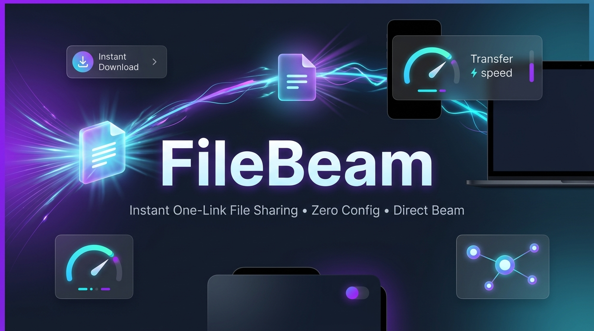



# ⚡ FileBeam

**Send files to anyone with one link. They just tap.**

No app for the receiver. No account. No upload-to-cloud wait.  
One Python file — that's the whole product.

**1. Drop files ➔ 2. Beam It ➔ 3. Share the link or QR code**

---

## 🚀 Try it right now — No install required

**Live web demo:** [https://filebeam.dpdns.org](https://filebeam.dpdns.org)  
*(Mirror: [filebeam.mrkawshikmr.workers.dev](https://filebeam.mrkawshikmr.workers.dev))*

| Feature | Hosted Web Demo (Lite) | Local App (Filebeam.py) |
|---|---|---|
| **Max Transfer Size** | **150 MB** (Edge KV lane) | **10 GB+** (Direct disk stream) |
| **Where it runs** | Cloudflare Edge Worker | Your PC, your rules |
| **Cost** | Free () | Free () |
| **Setup** | Zero install (browser only) | One command (python filebeam.py) |

The web demo is the full FileBeam experience in miniature. For heavy transfers (10 GB+ movies, datasets, project folders), run ilebeam.py locally.

---

## 💡 Why FileBeam?

You have a file on your PC. The other person has WhatsApp and zero patience.  
Every existing tool makes *someone* suffer — app store installs, account signups, file size caps, or "same Wi-Fi only" restrictions.

FileBeam removes all of it:

- 🚀 **Double-click and go** — Zero install, no env, no pip dependencies. python filebeam.py is the entire setup.
- 📱 **Receiver needs nothing but a browser** — Links open directly from WhatsApp, Telegram, iMessage, or phone cameras.
- 🔒 **Files never leave your machine** — When running locally, nothing sits on third-party cloud servers waiting to leak.
- ⚡ **LAN-fast, internet-capable** — Blazing fast on the same Wi-Fi; add --tunnel to reach anyone across the globe.
- 🧹 **Self-cleaning** — Beams auto-delete from memory and disk after 60 minutes.

---

## 📊 FileBeam vs The Usual Suspects

| Feature | **FileBeam** | AirDrop / QuickShare | LocalSend | Snapdrop | WeTransfer |
|---|---|---|---|---|---|
| **Receiver App Required?** | **❌ None (Browser)** | ❌ OS-locked | ✅ App required | ❌ None | ❌ None |
| **Cross-Platform?** | **✅ iOS / Win / Mac / Android** | ❌ Apple / Android only | ✅ Yes | ✅ Yes | ✅ Yes |
| **Works Over Internet?** | **✅ Yes (--tunnel)** | ❌ Same room only | ❌ Same Wi-Fi | ❌ Same Wi-Fi | ✅ Yes |
| **Account Required?** | **❌ No** | ❌ No | ❌ No | ❌ No | ⚠️ Upsells Pro |
| **One-Tap Chat Share** | **✅ WhatsApp / Telegram / QR** | ❌ Proprietary | ❌ No link | ❌ No link | ⚠️ Email + Link |
| **Size Limit** | **Your Disk (10 GB default)** | Device Storage | Device Storage | Browser RAM | 2 GB free cap |
| **Where Files Live** | **Your PC only** | Peer device | Peer device | RAM | Their cloud servers |
| **Open Source** | **✅ MIT License** | ❌ Proprietary | ✅ Open Source | ✅ Open Source | ❌ Closed Source |

---

## ⚡ Quick Start

### 🚀 Option 1: Instant One-Liner (No download needed — works from ANY folder)

`ash
# Windows (PowerShell / CMD):
curl.exe -sSL https://raw.githubusercontent.com/Kawshikmr/filebeam/main/filebeam.py | python

# macOS / Linux:
curl -sSL https://raw.githubusercontent.com/Kawshikmr/filebeam/main/filebeam.py | python3
`

---

### 📦 Option 2: Clone & Run Locally

`bash
git clone https://github.com/Kawshikmr/filebeam.git
cd filebeam
python filebeam.py
`

### 🌍 Transfer Over the Internet (Clickable WhatsApp Links)

`bash
python filebeam.py --tunnel
`

Spawns a temporary public HTTPS URL via [cloudflared](https://developers.cloudflare.com/cloudflare-one/connections/connect-networks/downloads/) (must be installed on PATH). Paste that link into any chat — WhatsApp linkifies it, the receiver taps it, and files stream straight from your machine.

---

## 🛠️ Options & CLI Flags

| Flag | Description |
|---|---|
| --port N | Run on a specific local port (default: 9348) |
| --max-gb N | Maximum total size per beam in GB (default: 10) |
| --tunnel | Expose via a temporary public HTTPS Cloudflare tunnel |
| --lan-only | Force local network mode only (disables tunnel check) |

---

## ⚙️ How It Works

1. Your browser uploads files in micro-chunks (256 KB buffers) to a tiny local Python HTTP server (http.server).
2. The server mints a random 6-character code from an unambiguous 32-character alphabet (ABCDEFGHJKMNPQRSTUVWXYZ23456789).
3. The receiver enters the code or clicks the link, sees the interactive file list with color-coded extensions, and downloads directly from your machine (or grabs everything as a single .zip).
4. Memory usage stays strictly under ~50 MB even for 10 GB+ transfers because files stream directly to and from disk.

---

## 📄 License

MIT License © 2026 Kawshik. Free and open source.
