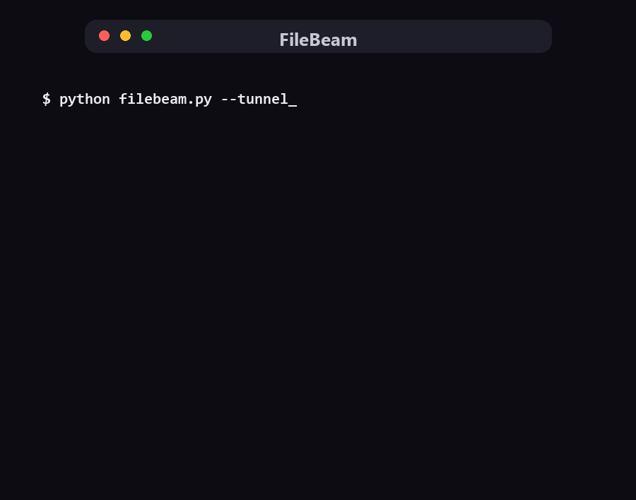

<div align="center">

# 📦 FileBeam

**Send files to anyone with one link. They just tap.**

No app for the receiver. No account. No upload-to-cloud wait.
One Python file — that's the whole product.




**1. Drop files → 2. Beam It → 3. Share the link or code**

</div>

---

## Why FileBeam?

You have a file on your PC. The other person has WhatsApp and zero patience.
Every existing tool makes *someone* suffer — installs, signups, caps, or "same WiFi only".
FileBeam removes all of it:

- 🖱️ **Double-click and go** — no install, no venv, no config. `python filebeam.py` is the entire setup.
- 📲 **Receiver needs nothing but a browser** — the link is clickable straight out of WhatsApp or Telegram.
- 🔒 **Files never leave your machine** — nothing sits on someone else's cloud waiting to expire or leak.
- 🚀 **LAN-fast, internet-capable** — instant on the same WiFi; add `--tunnel` to reach anyone anywhere.
- ⏳ **Self-cleaning** — beams auto-delete after 60 minutes. No trash drawer of old transfers.

## FileBeam vs the usual suspects

An honest comparison — every tool here is good at something:

| | **FileBeam** | WeTransfer | LocalSend | Snapdrop | Telegram |
|---|---|---|---|---|---|
| Receiver must install | **nothing** | nothing | its app | nothing | its app |
| Works over the internet | ✅ (`--tunnel`) | ✅ | ❌ same WiFi | ❌ same WiFi | ✅ |
| Sender setup | **one file** | website | install both ends | hosted site | app |
| Account needed | ❌ | upsells Pro | ❌ | ❌ | ✅ |
| One-tap share after upload | ✅ WhatsApp · Telegram · system sheet | ✅ email + link | ❌ no link exists | ❌ no link exists | ✅ *it is* the chat |
| Size limit | your disk (10 GB default) | ~2–3 GB free | disk | browser memory | 2 GB/file |
| Where files live | **your PC only** | their cloud | peer devices | RAM | their cloud |
| Open source | ✅ MIT | ❌ | ✅ | ✅ | ❌ |

*When to prefer others:* receiver offline for days → WeTransfer. Both on same WiFi and want an app UI → LocalSend. FileBeam wins the "right now, any network, zero friction" moment.

## Quick start

Requires Python 3.8+. That's it.

```bash
python filebeam.py
```

Open the printed URL, drop some files, share the code. The receiver opens the link
(or scans the QR), taps download. Done.

### Transfer over the internet (clickable WhatsApp links)

```bash
python filebeam.py --tunnel
```

Spawns a temporary public HTTPS URL via [cloudflared](https://developers.cloudflare.com/cloudflare-one/connections/connect-networks/downloads/)
(must be installed and on PATH). Paste that link into any chat — WhatsApp linkifies it,
the receiver taps it, files stream straight from your machine. FileBeam always runs the
tunnel with its own isolated config, so it can't collide with any cloudflared setup you already have.

## Options

| Flag | Description |
| --- | --- |
| `--port N` | Run on a specific port (default 9348) |
| `--max GB` | Max total size per beam in GB (default 10) |
| `--tunnel` | Expose via a temporary public HTTPS URL |

## Good to know

- **Windows firewall**: first run asks for network access — Allow, or phones can't reach you.
- **Tunnel links are temporary**: URL changes each restart, and your PC stays the server — if it sleeps, downloads pause.
- **Security**: whoever has both the URL and the code can download — same trust model as croc's phrase. Wrong-code guesses are rate-slowed; codes come from a 32-char unambiguous alphabet (~1 billion combos).
- **Zero external calls**: QR codes render locally as SVG. No telemetry, no analytics, no phoning home.
- Files stream to disk in chunks — RAM use stays tiny even for huge beams.

## How it works

Your browser uploads files in chunks to a tiny local HTTP server (stdlib only — no Flask, no npm).
The server mints a random 6-character code mapped to that beam. The receiver enters the code,
sees the file list, and downloads directly from your machine — or grabs everything as one zip.
With `--tunnel`, a Cloudflare quick tunnel fronts your server so chat apps see a clean HTTPS link.

## License

MIT
